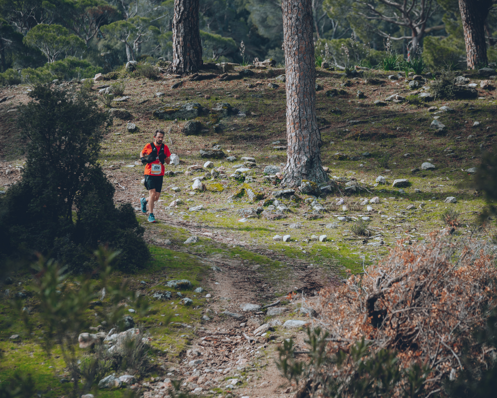
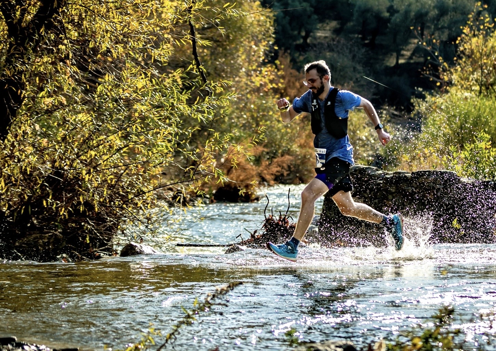

I am Ismail. I have spent years chasing one question: what makes wildfires spark? Turns out, answering it requires a lot of data, a lot of code and an unreasonable amount of patience with large datasets. Somewhere along the way, I fell in love with the data and code more than the flames.

Through my PhD at ETH Zurich and a postdoc at TU Munich, I have built predictive models for fire occurrence and danger, contributed to 10 peer-reviewed papers and developed a growing suspicion that what I really am is a data scientist who got lost in the forest, pun intended.

I am now looking to make that pivot and bring my background into data science and ML, ideally working on problems that are complex, impactful, and worth obsessing over.

Outside of work, I run long distances for fun (the longer and faster the better). When I am not running I am usually deeply invested in a video game keeping me up way too late. Not too late though. Sleep and recovery is important!

::: {layout-ncol="2"}
{width="13.3cm"}

{width="15cm"}
:::
